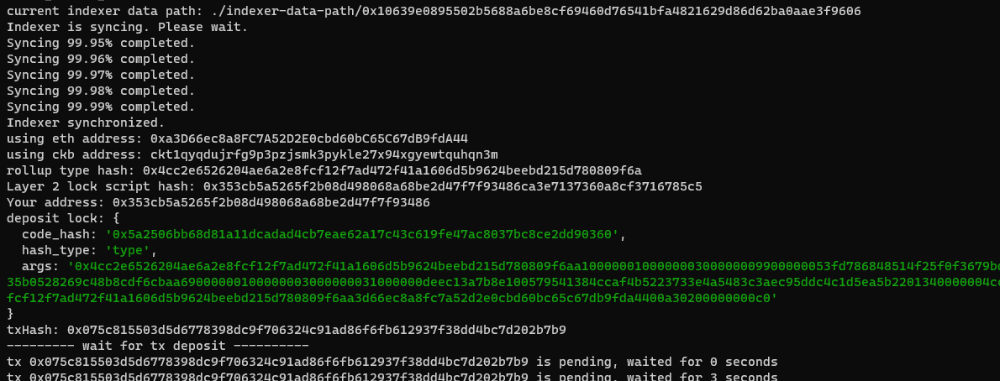

1. A screenshot of the accounts you created (`account list`) in `ckb-cli`.

   

2. A link to the Layer 1 address you funded on the [Testnet Explorer](https://explorer.nervos.org/aggron/).

   

3. A screenshot of the console output immediately after you have successfully submitted a deposit to Layer 2.

