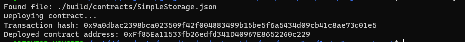

1) A screenshot of the console output immediately after you have successfully deployed a smart contract.
deployed

2) The transaction hash from the contract deployment (in text format).
0x9a0dbac2398bca023509f42f004883499b15be5f6a5434d09cb41c8ae73d01e5
3) The deployed contract address from the contract deployment (in text format).
0xFf85Ea11533fb26edfd341D40967E8652260c229