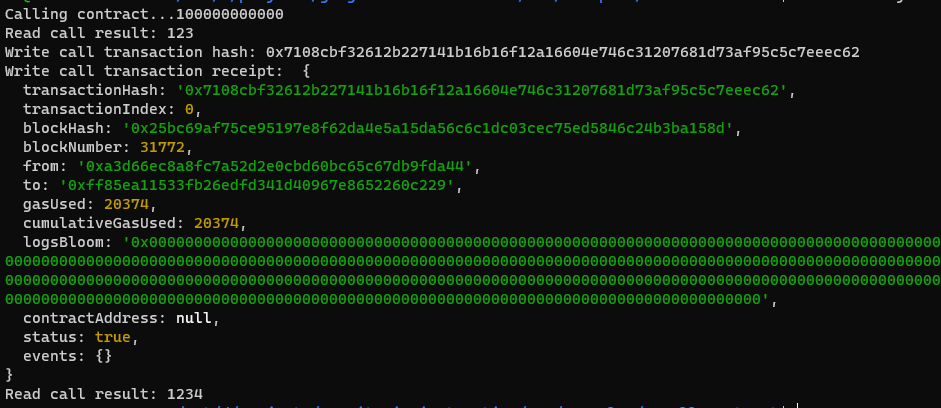

1. A screenshot of the console output immediately after you have successfully issued a smart contract call.

   

2. The `transaction hash` from the console output (in text format).

   0x7108cbf32612b227141b16b16f12a16604e746c31207681d73af95c5c7eeec62

3. The `contract address` that you called (in text format).

   0xFf85Ea11533fb26edfd341D40967E8652260c229

4. The `ABI` for contract you made a call on (in text format).

   ```
   [
       {
           "inputs": [],
           "stateMutability": "payable",
           "type": "constructor"
       },
       {
           "inputs": [
               {
                   "internalType": "uint256",
                   "name": "x",
                   "type": "uint256"
               }
           ],
           "name": "set",
           "outputs": [],
           "stateMutability": "payable",
           "type": "function"
       },
       {
           "inputs": [],
           "name": "get",
           "outputs": [
               {
                   "internalType": "uint256",
                   "name": "",
                   "type": "uint256"
               }
           ],
           "stateMutability": "view",
           "type": "function"
       }
   ]
   ```

   